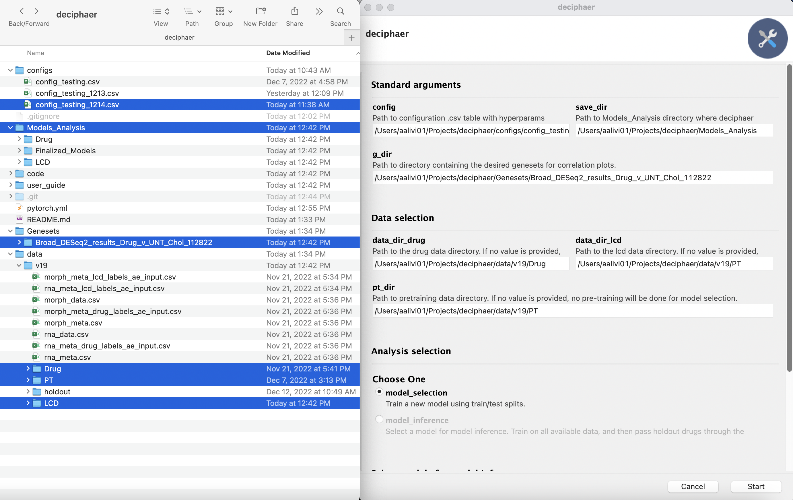
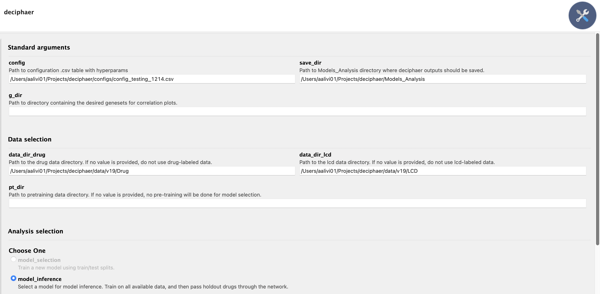
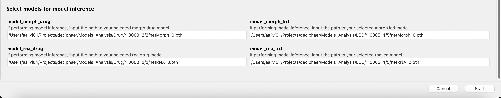

# DECIPHAER User Guide
*Code Authors: William Johnson and Ares Alivisatos; adapted from pytorch/examples/vae, ethanluoyc/pytorch-vae and uhlerlab/cross-modal-autoencoders*

## About
DECIPHAER (DEcoding Cross-modal Information of PHarmacologies via AutoEncodeRs) is a ML tool that learns a correlated low-dimensional representation of paired/unpaired multi-omics data. We used DECIPHAER to identify strong morphological and transcriptional features of Mycobacterium tuberculosis response to drug treatments and learn MOA of TB antibiotics. The following code is an inital posting, without raw data and complete scripts, associated with the pre-print: 

## Installation 

To install DECIPHAER, you will need to have anaconda and git installed on your machine.

- [guide for installing git] (https://github.com/git-guides/install-git)
- [guide for installing anaconda] (https://docs.anaconda.com/anaconda/install/index.html)

Once these are installed, navigate to your desired local directory in your Terminal and clone the git repository.

```
cd your_favorite_directory
git clone https://github.com/wjohnsonTufts/deciphaer.git
```

### Setting up your conda virtual environment
The main folder of the git repository contains the ``pytorch.yml`` file. The required packages for running DECIPHAER can be installed using this file via conda:

```
# navigate to the code directory
cd your_favorite_directoy/deciphaer/code
# create a new conda virtual environment
conda env create --name pytorch --file=pytorch.yml python=3.8.5 
# activate the enivronment
conda activate pytorch
```
NOTE: this environment will need to be activated each time you want to run DECIPHAER.

## Quick Start
To run DECIPHAER using one of the included datasets, simply:

```
# navigate to the code directory containing deciphaer.py
cd code
# run DECIPHAER using the GUI
pythonw deciphaer.py
```
NOTE: if you do not include the "w" after "python", the program will need you to directly specify your command line arguments in the terminal when it is initially invoked. See [running Deciphaer without the GUI](link) for more info.

### Model Selection
"Model Selection" refers to the process of repeatedly training and evaluating the performance of the multi-modal autoencoders using train/test splits. You will need a config with a list of model hyperparameters to test (manuscript_config_model_selection.csv) and train/test data with labels for the latent space classifier described in ()

To run model selection, the following command line arguments need to be filled in:

***Required arguments***

- ```config``` Path to your config files with hyperparameters for each run.
- ```save_dir``` Path to the Models_Analysis folder where outputs should be saved.
- ```model_selection``` mode must be activated.
- ```g_dir``` Path to the geneset folder to make correlation plots analyzing the models.

**ONE or BOTH** of the following arguments:

- ```data_dir_drug``` If you want to train on Drug labels, provide the path to the drug-labeled data.
- ```data_dir_lcd``` If you want to train on LCD labels, provide the path to the lcd-labeled data.

***Optional arguments***
- ```pt_dir``` If you want to pre-train the networks, provide the path to the pre-training data folder. If you don't put anything here, the networks will skip the pre-training step.

The image below shows all of the files and directories that are used as arguments for model selection. In this example, we are training on both drug and lcd labels, and pre-training the networks. 
 


### Model Inference
"Model Inference" refers to picking a specific set of models (selected using the metrics provided by model selection), using those models to train on all the available data, and then passing holdout data through the network to learn about drug mechanism of action.

To run model inference, the following command line arguments need to be filled in:

***Required arguments***

- ```config``` Path to your config files with hyperparameters for each run.
- ```save_dir``` Path to the Models_Analysis folder where outputs should be saved.
- ```model_inference``` mode must be activated.

**ONE or BOTH** of the following arguments:

- ```data_dir_drug``` If you want to train on Drug labels, provide the path to the drug-labeled data.
- ```data_dir_lcd``` If you want to train on LCD labels, provide the path to the lcd-labeled data.

**ONE or BOTH** of the following **pairs** of arguments:

- ```model_morph_drug``` and ```model_rna_drug```: path to the drug models that you want to do model inference on. To find these models, navigate to your Models_Analysis folder after performing model selection.
- ```model_morph_lcd``` and ```model_rna_lcd```: path to the lcd models that you want to do model inference on. To find these models, navigate to your Models_Analysis folder after performing model selection.

The image below shows an example of the fields to filled out for a model inference run. Note that the empty fields could be filled in with something or left blank, either way the program will ignore them because they are not applicable to the model inference pipeline.
 



# Project Road Map
- commented ```deciphaer.py``` functions giving users an idea of what should and shouldn't be casually edited
- data pre-processing script (rewrite in python? ```preprocess.py```)
- generic data modalities - each modality is a subclass inheriting the dataclass?

